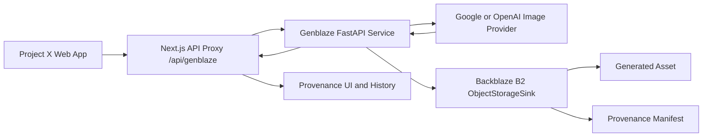

<div align="center">


# Project X — The Provenance-First Generative Media Lab

**[projectx.mylife-as-miles.my.id](https://projectx.mylife-as-miles.my.id)**

*A workspace for designing, executing, comparing, and reproducing generative-media experiments. Creators can build dynamic prompt templates, attach visual references, generate images through Genblaze, and preserve outputs and cryptographic provenance in Backblaze B2.*

</div>

---

## Architecture



---

## Built for the Backblaze Generative Media Hackathon

Project X includes:

- **Provider-backed Genblaze Pipeline** — `Pipeline.step(...).run(sink=...)` executes a genuine Google or OpenAI image provider through `Modality.IMAGE`.
- **Backblaze B2 Durable Storage** — `ObjectStorageSink` and `S3StorageBackend.for_backblaze(...)` persist provider-returned assets and Genblaze manifests.
- **Honest Verification** — the API reports success only after a provider asset exists, its URL is non-local, its SHA-256 is valid, and `manifest.verify()` returns `True`.
- **FastAPI Microservice** — a separate Python service handles Genblaze provider execution and B2 storage over HTTP.
- **Provenance UI** — Project X displays the actual run ID, provider, image model, asset URL, SHA-256, B2 object key when derivable, and verification status.

The withdrawn Pillow/direct-upload test is documented in [`docs/verification-evidence.md`](docs/verification-evidence.md) and is not presented as Genblaze evidence.

---

## Features

### Prompt Engineering & Execution Modes

- **Prompt Test (LLM)** — test prompt templates with Gemini text models.
- **Generate Image (Genblaze B2)** — execute an image-generation provider through Genblaze and store the result in B2.
- **Dynamic Template Variables** — add `{{ placeholders }}` and Project X creates the corresponding fields.
- **Custom Presets** — save, update, delete, import, export, and compare prompt presets.
- **Preset Diff Viewer** — compare the active configuration with saved versions.

### Multimodal Reference Assets

- Image references mapped to `@imageN`.
- MP4 and YouTube video references mapped to `@videoN` for prompt-analysis workflows.
- Gemini Files API support for large media references.

### Provenance & Durable Storage

- Backblaze B2 storage for generated assets and Genblaze manifests.
- Provider/model attribution from the actual Genblaze run.
- Asset SHA-256 and manifest canonical hash.
- Verification states that do not default to success.

---

## Built-in Presets

Project X includes 10 built-in system presets under `/prompts/presets/[preset_id]/`:

| Preset | Focus & Usage |
|--------|---------------|
| **Cine DeepDive** | Multi-dimensional film-scene analysis. |
| **Color Mapper** | Visual palette and color-psychology analysis. |
| **Comp Decoder** | Geometric composition and framing analysis. |
| **Film Lingo** | Translation from plain descriptions into filmmaker vocabulary. |
| **Genre Lexicon** | Genre and visual-movement conventions. |
| **Motion Lab** | Camera movement and its emotional motivation. |
| **Scene Lab** | Visual direction for character interactions. |
| **Shot Interp** | Professional shot-list and editing-rhythm breakdowns. |
| **Style Architect** | Reusable visual style-guide generation. |
| **Vis Narrative** | Director-level visual treatments and tonal maps. |

---

## Prerequisites

- Node.js 20+
- Python 3.11+
- Backblaze B2 bucket and application key
- At least one image provider key:
  - `GEMINI_API_KEY` or `GOOGLE_API_KEY`, or
  - `OPENAI_API_KEY`

---

## Environment Variables

```text
# Next.js → FastAPI
GENBLAZE_API_BASE_URL=http://127.0.0.1:8000

# Backblaze B2 — server only
B2_KEY_ID=
B2_APP_KEY=
# B2_APPLICATION_KEY is also accepted and mapped to B2_APP_KEY at runtime.
B2_BUCKET_NAME=

# Google image generation — server only
GEMINI_API_KEY=
GEMINI_IMAGE_MODEL=gemini-2.5-flash-image
# Optional Imagen fallback
IMAGEN_MODEL=imagen-3.0-generate-002

# Optional OpenAI image generation — server only
OPENAI_API_KEY=
OPENAI_IMAGE_MODEL=dall-e-3

# Explicit CORS allowlist for the Python service
PROJECTX_ALLOWED_ORIGINS=http://localhost:3000,https://projectx.mylife-as-miles.my.id

# Optional timeout in seconds
GENBLAZE_GENERATION_TIMEOUT=180
```

Never expose B2 or provider credentials through `NEXT_PUBLIC_*` variables or client requests.

---

## Getting Started

### 1. Install Node dependencies

```bash
git clone https://github.com/mylife-as-miles/Project-X.git
cd Project-X
npm install
```

### 2. Install the Python service

```bash
cd services/genblaze-api
python -m pip install -r requirements.txt
```

### 3. Start FastAPI from `services/genblaze-api`

```bash
uvicorn main:app --host 127.0.0.1 --port 8000
```

### 4. Start Next.js in a second terminal

```bash
cd ../..
npm run dev
```

Open `http://localhost:3000`.

---

## Testing

### Unit tests

```bash
python -m pytest services/genblaze-api/test_genblaze_api.py -m "not integration" -v
npx tsc --noEmit
npm run build
```

### Real provider + B2 integration test

Load real server-side credentials, then run:

```powershell
$env:RUN_GENBLAZE_INTEGRATION="1"
python -m pytest services/genblaze-api/test_genblaze_api.py -m integration -v -s
```

The integration test is skipped unless `RUN_GENBLAZE_INTEGRATION=1`. It must return a genuine provider-generated image URL, a 64-character asset SHA-256, and a manifest whose `verify()` method succeeds.

---

## Documentation

- [Hackathon Architecture](docs/hackathon-architecture.md)
- [Judge Testing Guide](docs/judge-testing-guide.md)
- [Demo Script](docs/demo-script.md)
- [Devpost Submission Copy](docs/submission-copy.md)
- [Verification Evidence](docs/verification-evidence.md)
- [Genblaze SDK Feedback](docs/genblaze-feedback.md)
