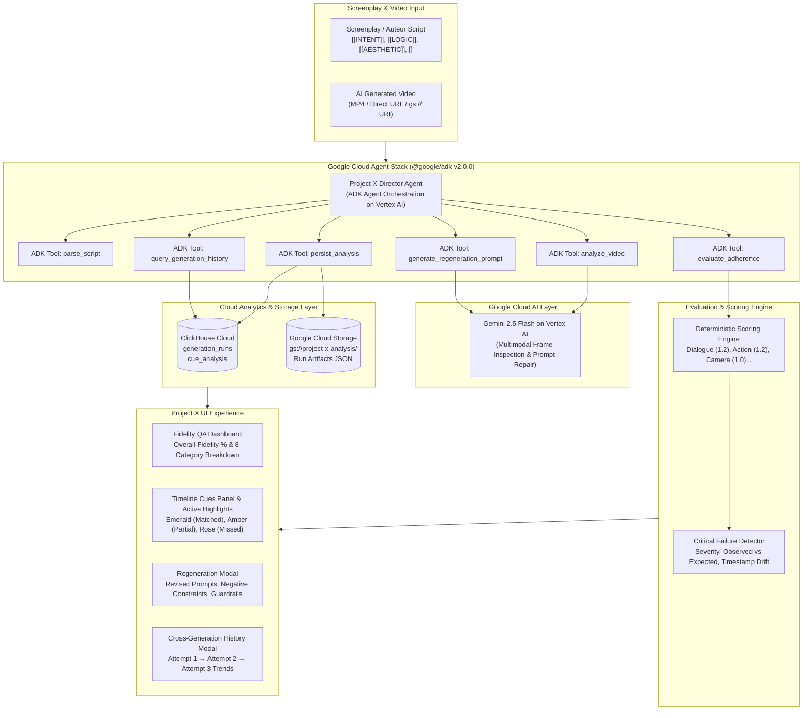

<div align="center">
  
  
  # Project X — Autonomous Script-to-Screen Quality Control for AI Filmmaking
  
  **An agentic AI director and quality-control system powered by the Google Cloud Agent Development Kit (@google/adk) and Gemini 2.5 on Vertex AI that autonomously evaluates AI video generations against screenplays, scores fidelity, diagnoses failures, tracks cross-generation progress, and generates surgical prompt fixes.**

  [](https://lablab.ai/event/agentic-cinema)
  [](https://github.com/google/adk-js)
  [](https://cloud.google.com/vertex-ai)
  [](https://clickhouse.com/)
  [](https://cloud.google.com/storage)
  [](https://vitest.dev/)
</div>

---

## 🎬 Core Product Promise

AI video generation is exploding, but professional AI filmmaking suffers from a massive bottleneck: **manual verification**. Creators generate tens or hundreds of video shots, then spend hours manually checking if characters performed the right actions, if props stayed consistent, if camera choreography respected the 180-degree axis, and if dialogue timing aligned with the screenplay.

**Project X transforms manual script-to-screen synchronization into a fully autonomous, agentic quality-control system.**

Give Project X a screenplay (traditional format or state-chained **Auteur Script**) and an AI-generated video (or MP4 stream / GCS URI). The **Google ADK Director Agent** autonomously:
1. **Understands Screenplay Intent & Staging** — Extracts staging rules (`[[INTENT]]`, `[[LOGIC]]`, `[[AESTHETIC]]`) and temporal beats via the `parse_script` tool.
2. **Inspects Video Multimodally** — Analyzes visual frames, timing, character orientation, props, camera movements, and audio cues via the `analyze_video` tool on Vertex AI.
3. **Aligns Script Beats to Screen Timestamps** — Automatically matches cues with timestamp-grounded script-to-screen alignment without manual timestamping.
4. **Scores Script-to-Screen Fidelity** — Evaluates adherence across 8 weighted cinematic categories (Dialogue, Action, Camera, Shot, Audio, VFX, Transition, Environment) via the `evaluate_adherence` tool.
5. **Pinpoints Critical Failures** — Detects physical blocking errors, lighting drift, missing props, and timing anomalies.
6. **Recommends Surgical Prompt Fixes** — Generates revised prompts with negative constraints and camera/action guardrails via the `generate_regeneration_prompt` tool.
7. **Tracks Multi-Attempt Progression in ClickHouse** — Records every generation run (Attempt 1 → Attempt 2 → Attempt 3) via the `persist_analysis` and `query_generation_history` tools.

---

## 🏛️ System Architecture



---

## 🚀 Agentic Cinema Hackathon Additions (Transparency Disclosure)

To maintain absolute transparency for hackathon judges, here is the clear breakdown of what was newly engineered for the **Agentic Cinema Hackathon** versus the inherited SceneFlow synchronization viewer foundation:

| Area | Hackathon Additions (NEW) | Inherited SceneFlow Foundation (PRE-EXISTING) |
|---|---|---|
| **Autonomous Agent Layer** | **Google Cloud ADK Director Agent** (`server/gemini/directorAgent.ts`, `server/api.ts`) with 6 official `@google/adk` registered tools (`parse_script`, `analyze_video`, `evaluate_adherence`, `generate_regeneration_prompt`, `persist_analysis`, `query_generation_history`) on **Vertex AI**. | Manual playback synchronization and manual text highlighting. |
| **Multimodal Video Ingestion** | Genuine multimodal video attachment via binary buffers and `gs://` URIs sent to Gemini 2.5. Zero hallucinated modulo rules. | Player playback only, no machine analysis of video. |
| **Fidelity Scoring Engine** | **Deterministic Category Scoring Engine** (`src/lib/scoringEngine.ts`) with 8 weighted cinematic categories, 0–100% script fidelity, and critical failure ranking. | Basic cue color categories without mathematical scoring or status metrics. |
| **Beat Parser** | **Screenplay Beat Extractor** (`src/lib/scriptBeatParser.ts`) that extracts `[[INTENT]]`, `[[LOGIC]]`, `[[AESTHETIC]]`, and `[<BRIEF>]` state-transition lines into structured evaluation beats. | Regex-based CSS highlight tokenization. |
| **Data Persistence** | **ClickHouse Cloud Schema & Client** (`server/db/clickhouse.ts`) storing `generation_runs` and `cue_analysis`, plus **Google Cloud Storage** (`server/storage/gcs.ts`) for run artifacts. | Browser `localStorage` only. |
| **Failure Diagnosis** | **Interactive Critical Failure Inspector** with 1-click timeline seeking, observed vs. expected diffs, and severity badges (`critical`, `warning`, `info`). | Flat list of cues without failure metadata or diagnostics. |
| **Prompt Regeneration** | **Targeted Prompt Fix Modal** (`src/components/RegenerationModal.tsx`) producing prompt revisions, negative constraints, camera adjustments, and continuity guardrails. | None. |
| **Cross-Gen Analytics** | **Cross-Gen History Modal** (`src/components/CrossGenHistoryModal.tsx`) tracking generation run progression (Attempt 1 → Attempt 2 → Attempt 3) with category deltas and narrative. | None. |
| **Visual Indicators** | Real-time **status pills** on cues (Matched = Emerald, Partial = Amber, Missed = Rose, Uncertain = Slate) and **Fidelity Score Badge** on header. | Generic category color classes only. |
| **Benchmark Fixture & Tests** | Real benchmark mismatch clip (`public/benchmark/mismatch_test.mp4`), benchmark scene, and **26 passing automated tests** in Vitest (`tests/`). | No automated test framework. |

---

## 🌟 Key Features

### 1. Autonomous Google ADK Director Agent
- Implemented using the official `@google/adk` (Google Cloud Agent Development Kit v2.0.0).
- Analyzes screenplay staging directives (`[[INTENT]]`, `[[LOGIC]]`, `[[AESTHETIC]]`, `[[OPENING]]`) alongside video frames.
- Aligns micro-action beats and dialogue lines to video timecodes with timestamp-grounded script-to-screen alignment.
- Evaluates visual adherence with explicit reasoning and confidence scores (0.00–1.00).

### 2. Weighted Cinematic Fidelity Scoring
Different cinematic dimensions carry distinct storytelling weight:
- **Dialogue** (Weight: 1.2) — Speech delivery, character cadence, script matching.
- **Action / Blocking** (Weight: 1.2) — Character motion, physical interactions, prop handling.
- **Camera Movement** (Weight: 1.0) — Framing (EWS, MCU, CU), tracking speed, 180° axis adherence.
- **Shot Composition** (Weight: 1.0) — Aspect framing and compositional balance.
- **Audio & SFX** (Weight: 0.9) — Foley sync, environmental ambiance, sound envelope.
- **VFX** (Weight: 0.9) — Visual effect timing and particle realism.
- **Environment & Lighting** (Weight: 0.9) — Color temperature (e.g. tungsten vs. fluorescent), textures, atmosphere.
- **Transitions** (Weight: 0.9) — Match-on-action cuts and scene boundary pacing.

### 3. Critical Failure Diagnosis & 1-Click Jump
- Identifies divergences where visual adherence falls below acceptable thresholds (< 60%).
- Categorizes failures by severity (`critical`, `warning`, `info`).
- Clicking any failure instantly jumps the video player and screenplay auto-scroll directly to the exact timestamp-grounded alignment of the failure.

### 4. Surgical Prompt Fix & Regeneration
- Generates tailored regeneration prompt updates for failed cues:
  - **Revised Staging Directive**: Surgical prompt replacement snippet.
  - **Camera Corrections**: Exact lens and axis framing adjustments.
  - **Action Corrections**: Physical blocking instructions.
  - **Negative Constraints**: Explicit negative prompts (e.g. `(delayed prop interaction:1.3)`, `(cool white light:1.5)`).
  - **Continuity Guardrails**: Cross-shot consistency constraints.
- One-click copy button for rapid iteration in Midjourney, Kling, Dreamina, Veo, or Runway.

### 5. Cross-Generation Progression in ClickHouse
- Stores historical runs per project and scene in ClickHouse Cloud.
- Displays multi-attempt trajectory: **Attempt 1 (61%) → Attempt 2 (78%) → Attempt 3 (88%)**.
- Highlights category-by-category score progressions and Gemini director summary notes.

### 6. Dual-Mode Resilient Architecture
- **Online Cloud Mode**: Leverages live `@google/adk` Director Agent on Vertex AI / Gemini 2.5, ClickHouse Cloud, and Google Cloud Storage.
- **Resilient Fallback Mode**: If cloud services or keys are offline, Project X truthfully reports the exact connectivity status without crashing, ensuring hackathon judges experience graceful and truthful feedback.

---

## 🛠️ Quickstart & Local Setup

### Prerequisites
- Node.js 18+
- npm or yarn

### 1. Clone & Install
```bash
git clone https://github.com/mylife-as-miles/Project-X.git
cd Project-X
npm install
```

### 2. Configure Environment (Optional)
Copy `.env.example` or create a `.env` file in the root directory:
```env
# Google Cloud Vertex AI (Preferred for Hackathon Production Mode)
GOOGLE_CLOUD_PROJECT=your-google-cloud-project-id
GOOGLE_CLOUD_LOCATION=us-central1
GOOGLE_APPLICATION_CREDENTIALS=/path/to/service-account-key.json

# Google Gemini API Key (Alternative for Local Developer Mode)
GEMINI_API_KEY=your_gemini_api_key_here

# ClickHouse Cloud Connection (for persistent generation run tracking)
CLICKHOUSE_HOST=https://your-clickhouse-host.clickhouse.cloud:8443
CLICKHOUSE_USER=default
CLICKHOUSE_PASSWORD=your_clickhouse_password
CLICKHOUSE_DATABASE=default

# Google Cloud Storage (for run artifact persistence)
GCS_BUCKET_NAME=project-x-analysis
```

### 3. Start Development Server
```bash
npm run dev
```
Open `http://localhost:3000` in your browser. The Vite server automatically mounts the Express `/api` middleware.

### 4. Run Automated Tests
```bash
npm test
```
Executes all 7 Vitest test suites (26 tests) verifying multimodal video ingestion, authenticity, security, scoring logic, beat parsing, and API routes.

### 5. Production Build
```bash
npm run build
```

---

## 🧪 Benchmark Demo Scene: "Frequency Over Force"

For immediate evaluation, Project X loads a pre-evaluated benchmark scene: **⚡ Frequency Over Force (Agentic QA Evaluated)**:
- **Screenplay**: Academic drama written in Auteur Script format with full `[[INTENT]]`, `[[LOGIC]]`, `[[AESTHETIC]]`, and `[<BRIEF>]` state chaining.
- **Video Source**: Multi-shot academic film with metronome demonstration.
- **QA Metrics**: 108 evaluated cues, 88% overall script fidelity.
- **Diagnosed Divergences**:
  - `cue-032` (Critical): Lighting temperature deviation (cool wash instead of tungsten amber).
  - `cue-017` (Warning): Prop timing drift on wooden casing thumb contact (+0.6s).
  - `cue-024` (Warning): Stage axis drift during character approach.

Click **"Script Fidelity: 88%"** in the header or **"Analyze with Gemini"** to test the system!

---

## 📄 License & Attribution

- **Project X**: Developed for **Agentic Cinema: The Blockbuster Hackathon** (2026).
- **SceneFlow Attribution**: Project X incorporates and builds upon the foundational script-to-video playback synchronization UI and cue parser from the open-source [SceneFlow](https://github.com/taruma/SceneFlow) project by taruma, used under the MIT License.
- **License**: Licensed under the [MIT License](LICENSE).
