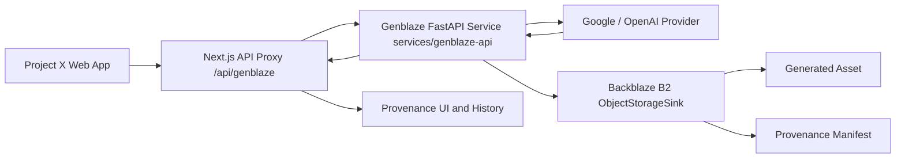

<div align="center">


# Project X — The Provenance-First Generative Media Lab

**[projectx.mylife-as-miles.my.id](https://projectx.mylife-as-miles.my.id)**

*A production-minded workspace for designing, executing, comparing, and reproducing generative-media experiments. Creators can build dynamic prompt templates, attach visual references, generate media through the Genblaze Python SDK, and preserve outputs and cryptographic provenance in Backblaze B2.*

</div>

---

## Architecture Diagram



---

## ⚡ Built for the Backblaze Generative Media Hackathon

Project X was enhanced for the **Backblaze Generative Media Hackathon: Build with Genblaze on B2**:

- **Real Genblaze Pipeline (`genblaze-core`)**: Executes media generation pipelines (`Modality.IMAGE`) using the official Genblaze Python SDK.
- **Backblaze B2 S3 Object Storage (`genblaze-s3`)**: Uses `ObjectStorageSink` and `S3StorageBackend.for_backblaze(...)` to automatically upload generated media assets, project configurations, and canonical manifests to Backblaze B2 (`b2://projectx-genblaze-media`).
- **Cryptographic Provenance Manifests**: Generates canonical Genblaze Provenance Manifests (`$schema: https://genblaze.org/schemas/v1/manifest.json`) with byte-level SHA-256 asset hashing and `Manifest.verify()` checks.
- **FastAPI Microservice Architecture**: Decoupled Python service (`services/genblaze-api/`) handling provider execution and B2 uploads cleanly over HTTP.
- **Provenance UI & History Panel**: Renders real Run IDs, Pipeline IDs, B2 object keys, SHA-256 hashes, and verification badges in the output panel and session history.

---

## Features

### 🎛️ Prompt Engineering & Execution Modes
- **Dual Execution Modes**:
  - **1. Prompt Test (LLM)**: LLM text prompt analysis and template compilation using Google Gemini.
  - **2. Generate Image (Genblaze B2)**: Media generation pipeline using the Genblaze Python SDK and Backblaze B2 storage.
- **Dynamic Template Variables** — Add `{{ placeholders }}` to your prompt template and form fields appear automatically. No hardcoding needed.
- **Custom Presets** — Save, update, or delete your own presets. Share them via URL or import/export as JSON files. Visual badges show whether a preset is loaded or has unsaved changes.
- **Preset Compare & Diff Viewer** — Side-by-side differences between your current config and any saved preset, with color-coded additions and deletions.

### 🖼️ Multimodal Reference Assets
- **Image References** — Drag and drop images as casting or scene references, auto-mapped to `@imageN`.
- **Video References (MP4 & YouTube)** — Upload MP4 video clips or paste YouTube URLs, validated and mapped to `@videoN` annotations.
- **Gemini Files API** — Direct upload and management of media files up to 2 GB with built-in file browsing.

### 🛡️ Provenance & Durable Storage
- **Backblaze B2 Cloud Storage** — S3-compatible cloud object storage for assets, thumbnails, metadata, and provenance manifests.
- **Cryptographic Transparency** — Real-time display of asset SHA-256, B2 object keys, manifest URLs, and verification status.

---

## Built-in Presets

ProjectX includes 10 built-in system presets stored under `/prompts/presets/[preset_id]/`:

| Preset | Focus & Usage |
|--------|---------------|
| **Cine DeepDive** | A comprehensive film analysis tool performing multi-dimensional scene breakdowns across shot design, framing, lighting, and composition. |
| **Color Mapper** | Extracts and analyzes the emotional logic and color psychology of visual palettes. |
| **Comp Decoder** | Reverse-engineers visual framing into geometric compositional building blocks. |
| **Film Lingo** | Translates plain-English scene concepts into precise filmmaker vocabulary. |
| **Genre Lexicon** | Deconstructs the signature visual DNA and stylistic conventions of specific genres. |
| **Motion Lab** | Analyzes camera movement types, speed qualities, and emotional motivations. |
| **Scene Lab** | Translates character interactions into cinematic visual descriptions. |
| **Shot Interp** | Breaks down finished scenes into professional shot lists and cut rhythms. |
| **Style Architect** | Synthesizes visual references into a comprehensive, reusable visual style guide. |
| **Vis Narrative** | Transforms creative ideas into director-level visual treatments with loglines and tonal maps. |

---

## Prerequisites

- [Node.js](https://nodejs.org/) 20 or later
- [Python](https://www.python.org/) 3.12 or later
- [Backblaze B2 Account & Credentials](https://www.backblaze.com/cloud-storage) (`B2_KEY_ID`, `B2_APPLICATION_KEY`)

---

## Getting Started

### 1. Clone Repository & Install Node Dependencies

```bash
git clone https://github.com/mylife-as-miles/Project-X.git
cd Project-X
npm install
```

### 2. Install Python Genblaze Dependencies

```bash
pip install -r services/genblaze-api/requirements.txt
```

### 3. Start Genblaze Python Service

```bash
uvicorn services.genblaze-api.main:app --host 127.0.0.1 --port 8000
```

### 4. Start Next.js Development Server

```bash
npm run dev
```

Open [http://localhost:3000](http://localhost:3000) in your browser.

---

## Verification & Testing

Run the Pytest suite for the Genblaze Python microservice:

```bash
pytest services/genblaze-api/test_genblaze_api.py
```

Run Next.js build and type checking:

```bash
npm run build
```

---

## Documentation Links

- [Hackathon Architecture](docs/hackathon-architecture.md)
- [Judge Testing Guide](docs/judge-testing-guide.md)
- [Demo Script](docs/demo-script.md)
- [Devpost Submission Copy](docs/submission-copy.md)
- [Verification Evidence Log](docs/verification-evidence.md)
- [Genblaze SDK Developer Feedback](docs/genblaze-feedback.md)
