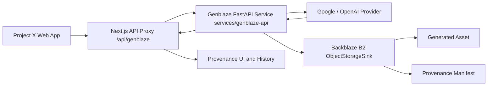

# Project X — Hackathon Architecture & Data Flow

## Overview

Project X is repositioned and implemented as **The Provenance-First Generative Media Lab** for the **Backblaze Generative Media Hackathon: Build with Genblaze on B2**.



## System Components

### 1. Frontend Workspace (Next.js 15+ Client UI)
- **Execution Mode Switcher**:
  - **Prompt Test**: LLM text prompt analysis and template compilation using Google Gemini SDK.
  - **Generate Image**: Real Genblaze Python SDK pipeline execution for media creation and Backblaze B2 cloud storage.
- **Provenance & Storage Panel**: Displays exact real run metadata including Run ID, Pipeline ID, Provider, Model, Modality, Asset SHA-256, Backblaze B2 Object Key, Manifest B2 Key, and Verification Status (`Verified` / `Stored Unverified`).

### 2. Next.js API Proxy (`app/api/genblaze/route.ts`)
- Server-side route validating incoming request parameters (`projectId`, `compiledPrompt`, `provider`, `model`, `parameters`).
- Strips sensitive headers and delegates generation to the internal Genblaze Python microservice over HTTP (`GENBLAZE_API_BASE_URL`).
- Returns honest HTTP status codes (`400 Bad Request`, `422 Unprocessable Content`, `502 Bad Gateway`, `500 Internal Error`).
- Eliminates client-supplied credentials and mock success fallbacks.

### 3. Genblaze FastAPI Microservice (`services/genblaze-api/`)
- Standalone Python 3.12 FastAPI service running `genblaze-core`, `genblaze-s3`, `genblaze-google`, and `genblaze-openai`.
- Instantiates a real Genblaze `Pipeline` with `Modality.IMAGE`.
- Connects to Backblaze B2 using `S3StorageBackend.for_backblaze(bucket, region, access_key_id, secret_access_key)` and `ObjectStorageSink` with `KeyStrategy.HIERARCHICAL`.
- Computes byte-level SHA-256 asset hashes.
- Generates canonical Genblaze Provenance Manifests (`$schema: https://genblaze.org/schemas/v1/manifest.json`).

### 4. Backblaze B2 Object Storage (`b2://projectx-genblaze-media`)
Organizes stored artifacts into structured, production-minded paths:
```text
projects/{projectId}/
  runs/{runId}/
    output/
      generated-image.png
    metadata/
      provenance-manifest.json
```

## Security Boundaries & Controls

- **Zero Client Credentials**: `B2_KEY_ID`, `B2_APPLICATION_KEY`, and provider secrets are read strictly from server-side environment variables.
- **Input Validation**: `projectId` and `compiledPrompt` are enforced; payload limits (max 10 MB) and MIME allowlists (`image/png`, `image/jpeg`, `application/json`) prevent arbitrary file uploads.
- **Honest Error Handling**: Failures return `success: false` and accurate HTTP status codes without fabricating fake URLs or hashes.
